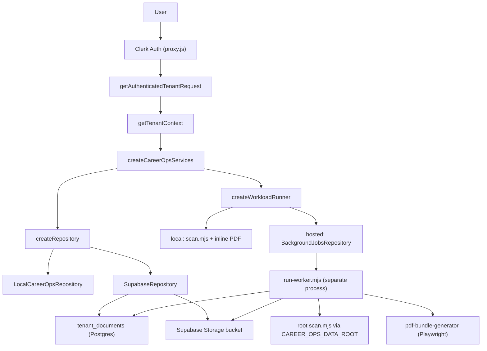
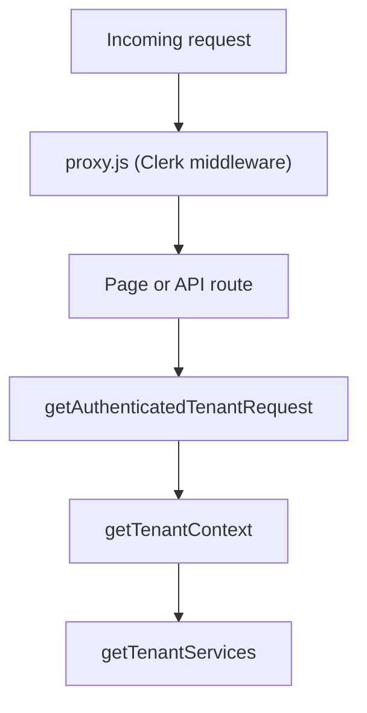
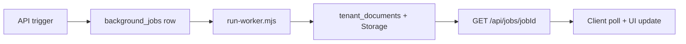

# Hosted Vercel Readiness

This document describes the hosted Career-Ops architecture: what is implemented today (MVP), what remains before a real deployment, and the longer-term normalized schema. The hosted product model is single-user: each Clerk user owns one private job-search workspace with their own CV, profile, search criteria, queue, reports, and generated files.

**Status:** MVP plumbing is in place (Clerk boundary, Supabase repository, background job queue, worker script, contract tests). This is not production-ready. Live hosted end-to-end validation against real Supabase, Clerk, Vercel, and a long-running worker has not been completed.

## Architecture Decisions

These defaults still apply:

| Area | Decision | Rationale |
|------|----------|-----------|
| Auth | Clerk | Familiar provider, strong Next.js support, enough for single-user workspaces now |
| Tenant key | Clerk `userId` | One private workspace per user, no org model yet |
| App host | Vercel | Fits the interactive Next dashboard and API trigger layer |
| Structured data | Postgres | Durable, queryable source of truth for queue, applications, reports, profile, and scan state |
| File storage | Object storage | PDFs and larger user artifacts should not live in Vercel function storage |
| Background work | External worker process | Scans, deep dives, and PDFs are too long or browser-heavy for normal request paths |
| Local development | Existing filesystem repository | Keeps the open-source/local workflow working while hosted storage is added |

Recommended provider pairings for a full production stack:

- Clerk + Neon + Vercel Blob + Inngest
- Clerk + Supabase Postgres + Supabase Storage + a container worker (current MVP path)
- Clerk + RDS/Neon + S3/R2 + a small container worker

The Supabase path matches the current implementation. A third-party queue (Inngest, Trigger.dev) remains optional; the MVP uses Postgres `background_jobs` with lease-safe RPCs.

## Current MVP Architecture (Implemented)

The hosted path reuses the same app-facing contract as local mode. Routes call `getTenantServices` / `getTenantDashboardModel`; services select storage and workload behavior from `CAREER_OPS_TENANT_MODE`.



### Mode switch

| Variable | `local-dev` (default) | `hosted` |
|----------|-------------------------|----------|
| `CAREER_OPS_TENANT_MODE` | Filesystem under `CAREER_OPS_PATH` | Supabase Postgres + Storage |
| Auth | Optional (`x-tenant-id`, env, default tenant) | Clerk required in production |
| Scan / PDF APIs | Inline (`child_process` / Playwright in request) | Enqueue job, HTTP `202`, client polls |
| Job status API | Returns `404` ("unavailable in local mode") | Tenant-scoped poll |

Consolidated in commits `cc5f22c` (repository unification) and `b03471b` (durable job queue).

## Future Normalized Schema (Not Implemented)

The MVP stores tenant text as path-keyed rows in `tenant_documents` and binaries in object storage. A future phase can normalize into typed tables without changing route contracts:

| Table | Current MVP source | Notes |
|-------|-------------------|-------|
| `users` | Clerk user | Mirror Clerk id, email, timestamps |
| `user_profiles` | `config/profile.yml` in `tenant_documents` | Parsed YAML as JSON |
| `user_agent_profiles` | `modes/_profile.md` | Per-user narrative and archetypes |
| `search_configs` | `portals.yml` | Drives scan jobs |
| `documents` | `cv.md`, interview docs, etc. | Typed markdown with slug |
| `pipeline_items` | `data/pipeline.md` | URL inbox rows |
| `applications` | `data/applications.md` | Tracker with canonical status |
| `evaluations` | `reports/*.md` | Parsed metadata plus body |
| `evaluation_state_events` | report frontmatter history | Workflow audit trail |
| `job_descriptions` | `jds/*` | Saved JDs |
| `scan_events` | `data/scan-history.tsv` | Dedup by `(user_id, url)` |
| `scan_runs` | scanner stdout / job results | Run-level counters |
| `follow_ups` | `data/follow-ups.md` | Follow-up cadence |
| `generated_files` | `output/*.pdf` metadata | Storage key, MIME, size, related entity |

Repo/system files (`modes/*` except `_profile.md`, `templates/*`, root scripts, `templates/states.yml`) remain deploy-time assets, not per-user records.

## Route And Runtime Inventory

Express server is legacy-only (`dashboard-web/LEGACY.md`). Active Next.js surface:

| Route | Type | Auth | Local runtime | Hosted runtime |
|-------|------|------|---------------|----------------|
| `/` | Dashboard | Required when Clerk configured | Filesystem via `LocalCareerOpsRepository` | `tenant_documents` + Storage |
| `/queue` | Queue page | Required | Reads/writes `data/pipeline.md` | Same paths in `tenant_documents` |
| `/scan` | Scan page | Required | Reads scan history from filesystem | Reads from `tenant_documents`; polls jobs after trigger |
| `/job/[slug]` | Job detail | Required | Report markdown from filesystem | Report path in `tenant_documents` |
| `/manage`, `/manage/profile`, `/manage/resume`, `/manage/search`, `/manage/strategy` | Settings UI | Required | Filesystem | `tenant_documents` |
| `/api/queue` | Mutation | Required | Writes pipeline file | Upserts `data/pipeline.md` row |
| `/api/transition-state` | Mutation | Required | Rewrites report frontmatter | Upserts report in `tenant_documents` |
| `/api/scan` | Workload trigger | Required | Runs `scan.mjs` inline (`child_process`) | Enqueues `scan` job, HTTP `202` |
| `/api/generate-resume` | Workload trigger | Required | Playwright inline | Enqueues `pdf` job (`kind: resume`), HTTP `202` |
| `/api/generate-cover-letter` | Workload trigger | Required | Playwright inline | Enqueues `pdf` job (`kind: cover-letter`), HTTP `202` |
| `/api/generate-eval-report` | Workload trigger | Required | Playwright inline | Enqueues `pdf` job (`kind: eval-report`), HTTP `202` |
| `/api/generate-full-eval` | Workload trigger | Required | Playwright inline | Enqueues `pdf` job (`kind: full-eval`), HTTP `202` |
| `/api/jobs/[jobId]` | Job status | Required | `404` (not available) | Tenant-filtered poll; cross-tenant returns `404` |
| `/api/manage/*`, `/api/setup`, `/api/onboarding` | Settings/onboarding | Required | Filesystem | `tenant_documents` |
| `/download-pdf` | File access | Required | Reads tenant `output/*.pdf` | Streams from Storage via repository |
| `/api/health` | System | Public | Stateless JSON | Same |

Client polling for hosted jobs: `dashboard-web/lib/client/job-polling.js` (used by `ScanControls`, `JobActions`, `ResumeForm`).

## Clerk Boundary (Implemented)

Clerk is the trusted production source of tenant identity when keys are configured.

- **Middleware:** `dashboard-web/proxy.js` wraps `@clerk/nextjs/server` `clerkMiddleware`. Protects all routes except `/api/health`. If Clerk keys are absent, middleware is a no-op (local dev).
- **Request adapter:** `getAuthenticatedTenantRequest` (`lib/auth/clerk-request.js`) calls `auth()` and maps `userId` to `{ auth: { tenantId: userId } }` via `clerkAuthToTenantRequest`.
- **Tenant resolution:** `getTenantContext` prefers auth tenant, then (non-production) `x-tenant-id` when allowed, then `CAREER_OPS_TENANT_ID`, then `local-dev`. In `hosted` + production, missing auth fails closed.
- **Central entry:** Pages and APIs use `getTenantServices` / `getTenantDashboardModel`; route code does not call Clerk directly.



Dev escape hatches (not for production): `CAREER_OPS_ALLOW_DEV_TENANT_HEADER=true`, `CAREER_OPS_TENANT_ID`, or running without Clerk keys.

## Repository Model (Implemented)

Storage is selected by `createRepository` (`lib/repositories/repository-factory.js`):

| Implementation | When | Text | Binary (PDFs) |
|----------------|------|------|---------------|
| `LocalCareerOpsRepository` | `CAREER_OPS_TENANT_MODE=local-dev` | Sync filesystem under `CAREER_OPS_PATH` (or `tenants/{id}/`) | Local `output/` |
| `SupabaseRepository` | `CAREER_OPS_TENANT_MODE=hosted` | `tenant_documents` table, in-memory cache per request | Supabase Storage bucket |

Both implement the same path-key contract consumed by `CareerOpsDataClient` (`lib/data/career-ops-data-client.js`). Logical paths mirror the local layout (`config/profile.yml`, `data/pipeline.md`, `reports/*.md`, `output/*.pdf`, etc.).

Contract tests: `dashboard-web/test/repository-contract.test.js` (fake Supabase client + local temp dir).

## Current Data Schema

Schema file: `dashboard-web/supabase/schema.sql`. Apply manually in the Supabase SQL editor (no migration runner yet).

### `tenant_documents`

Path-keyed text store for all markdown, YAML, TSV, and JSON tenant files.

```sql
tenant_id  text        not null
path       text        not null   -- e.g. config/profile.yml, reports/042-acme-2026-01-01.md
content    text        not null default ''
updated_at timestamptz not null default now()
primary key (tenant_id, path)
```

Index: `(tenant_id, path)` for prefix scans.

### `background_jobs`

Durable queue for hosted scan and PDF workloads.

```sql
id           uuid primary key
tenant_id    text not null
job_type     text not null   -- 'scan' | 'pdf'
status       text not null   -- 'queued' | 'running' | 'completed' | 'failed'
payload      jsonb
result       jsonb
error        text
worker_id    text
claimed_at   timestamptz
completed_at timestamptz
created_at   timestamptz
updated_at   timestamptz
```

RPCs (race-safe claiming):

- `claim_next_background_job(p_worker_id, p_stale_seconds)` -- reclaims stale `running` rows, claims oldest `queued`
- `reclaim_stale_background_jobs(p_stale_seconds)`

Repository: `lib/repositories/background-jobs-repository.js`.

### Object storage key convention

```js
// lib/repositories/storage-keys.js
`${tenantId}/${relPath}`   // e.g. local-dev/output/resume-acme.pdf
```

Bucket: `SUPABASE_STORAGE_BUCKET` (default `career-ops-files`). PDFs use logical path `output/{filename}.pdf`. Upload content-type: `application/pdf`.

### Service role and RLS

Both tables have RLS **enabled** but the app and worker use the **service role key**, which bypasses RLS. There are no user-scoped policies tied to Clerk JWTs yet. All tenant isolation is enforced in application code (`tenant_id` filters on every query). Adding Clerk JWT policies is a future hardening step; until then, never expose the service role key to the client.

## Background Job Flow (Implemented)

| Workload | Local | Hosted |
|----------|-------|--------|
| Scan | `/api/scan` runs `scan.mjs` via `tenant-cli-runner` | Enqueue `scan`; worker materializes tenant docs, runs `scan.mjs`, syncs artifacts |
| PDF (resume, cover, eval) | API launches Playwright in-process | Enqueue `pdf` with `kind` + inputs; worker runs `pdf-bundle-generator` |
| Deep-dive scan | Same inline path with longer timeout | Same queue; worker uses 300s timeout |
| Liveness checks | Root CLI (Playwright) | Not queued yet |
| Tracker merge/dedup | File scripts | Still file-oriented in local workflows |

**Enqueue response:** `{ mode: 'hosted-job', jobId, status, jobType, pollUrl }` with HTTP `202`.

**Poll:** `GET /api/jobs/[jobId]` returns normalized job row for the authenticated tenant only.

**Worker:** `dashboard-web/scripts/run-worker.mjs` -- separate long-lived process, not a Vercel function.

- Requires: `SUPABASE_URL`, `SUPABASE_SERVICE_ROLE_KEY`
- Env: `WORKER_ID`, `WORKER_POLL_INTERVAL_MS` (default 5000), `WORKER_STALE_SECONDS` (default 900)
- Commands: `npm run worker` (loop), `npm run worker:once` (single claim)
- Scan flow: `tenant-materializer.js` writes `portals.yml`, pipeline, scan history, applications to temp dir; runs root `scan.mjs` with `CAREER_OPS_DATA_ROOT`; syncs `data/pipeline.md` and `data/scan-history.tsv` back
- PDF flow: `SupabaseRepository` + existing generators; payload carries `kind` and inputs only (no tenant override)

**Worker dependencies:** Full career-ops repo checkout on disk (`CAREER_OPS_PATH` or auto-detected parent), Node, Playwright browsers installed, network egress for portal APIs.



## Remaining Gaps

These are the actual open items before calling hosted deployment done. Earlier blockers (Clerk placeholder, filesystem-only repository, inline scan/PDF on hosted routes, missing job queue) are resolved in the MVP.

**Deployment and ops**

- No live hosted E2E run documented (Clerk sign-in, onboarding write, scan enqueue, worker claim, PDF download).
- `vercel.json` / project Root Directory not committed; Vercel must use `dashboard-web` as root (or equivalent monorepo config).
- Worker must run outside Vercel (VM, container, Railway, Fly.io, etc.) with repo checkout, Playwright, and env vars.
- Playwright browser install and headless deps on the worker host.
- Worker health monitoring, restart policy, and stale-job alerting not built.
- No CI job that applies `schema.sql` or validates Supabase connectivity.

**Security and tenancy**

- RLS policies not mapped to Clerk JWT; isolation relies on service-role server code.
- `generated_files` metadata table absent; download auth is tenant session + filename validation only.
- No audit log for cross-tenant access attempts.

**Product and data**

- Normalized tables (applications rows, pipeline items, evaluation metadata) not extracted from path-keyed documents.
- Batch tracker TSV flow (`batch/tracker-additions/`) unchanged; hosted should use direct DB writes or job events.
- Liveness checks, scheduled scans, and maintenance jobs not on the queue.
- Onboarding for brand-new Clerk users (seed empty workspace) needs hosted validation.
- Optional filesystem migration (`scripts/migrate-to-supabase.mjs`) copies `tenants/{id}/` layout; mapping local `local-dev` to a Clerk `userId` is manual.

**Vercel-specific**

- Request functions must not bundle Playwright (hosted PDF path already avoids this; verify build output).
- `CAREER_OPS_PATH` still required on the worker for `scan.mjs`, not on Vercel app functions for user data reads.
- Production must set `CAREER_OPS_TENANT_MODE=hosted`; no silent fallback to filesystem.

## Deployment Runbook

### 1. Supabase

1. Create a Supabase project.
2. Run `dashboard-web/supabase/schema.sql` in the SQL editor (creates `tenant_documents`, `background_jobs`, RPCs, enables RLS).
3. Create a Storage bucket named `career-ops-files` (or set `SUPABASE_STORAGE_BUCKET`).
4. Copy **Project URL** and **service_role** key (server-only).

### 2. Clerk

1. Create a Clerk application.
2. Copy **Publishable key** and **Secret key**.
3. Set allowed redirect URLs for the Vercel deployment domain.

### 3. Vercel (Next app)

1. Import the repo; set **Root Directory** to `dashboard-web`.
2. Set environment variables:

| Variable | Value |
|----------|-------|
| `NEXT_PUBLIC_CLERK_PUBLISHABLE_KEY` | Clerk publishable key |
| `CLERK_SECRET_KEY` | Clerk secret key |
| `SUPABASE_URL` | Supabase project URL |
| `SUPABASE_SERVICE_ROLE_KEY` | Service role key (never `NEXT_PUBLIC_`) |
| `SUPABASE_STORAGE_BUCKET` | `career-ops-files` (or your bucket name) |
| `CAREER_OPS_TENANT_MODE` | `hosted` |

3. Deploy. Confirm `/api/health` is public and sign-in protects other routes.

### 4. Optional data migration

If you have existing local tenant folders under `tenants/{id}/`:

```bash
cd dashboard-web
SUPABASE_URL=... SUPABASE_SERVICE_ROLE_KEY=... \
  node scripts/migrate-to-supabase.mjs [--tenant <id>] [--dry-run]
```

Text files (`.md`, `.yml`, `.tsv`, etc.) go to `tenant_documents`; PDFs go to Storage with `{tenantId}/{path}` keys.

### 5. Background worker (separate host)

1. Clone the full career-ops repo (worker needs root `scan.mjs`, `templates/`, etc.).
2. Install dependencies in `dashboard-web` and root as needed; install Playwright browsers.
3. Set env: `SUPABASE_URL`, `SUPABASE_SERVICE_ROLE_KEY`, `WORKER_ID`, optional poll/stale vars, `CAREER_OPS_PATH` if auto-detect fails.
4. Run: `cd dashboard-web && npm run worker` (or `worker:once` for testing).
5. Keep the process supervised (systemd, Docker, platform worker).

Do not deploy the worker as a Vercel serverless function.

## Verification Checklist

### Automated (run locally)

```bash
cd dashboard-web
npm test
npm run build
```

Existing hosted-related tests:

- `test/clerk-request.test.js` -- auth adapter
- `test/tenant-context.test.js` -- fail-closed hosted/production
- `test/repository-contract.test.js` -- local vs Supabase repository parity
- `test/repository-factory.test.js` -- mode selection
- `test/background-jobs-repository.test.js` -- enqueue, claim, complete, fail
- `test/workload-runner.test.js` -- local vs hosted branching
- `test/hosted-workload.test.js` -- API enqueue paths
- `test/job-executor.test.js` -- scan/PDF executor wiring
- `test/job-polling.test.js` -- client poll helper

### Manual hosted E2E (required before production)

- [ ] Clerk sign-up/sign-in on deployed Vercel URL
- [ ] Onboarding writes profile, CV, portals to `tenant_documents`
- [ ] Dashboard and queue read back tenant data
- [ ] `/api/scan` returns `202` with `pollUrl`; worker completes job; pipeline/scan-history update
- [ ] PDF generation returns `202`; worker writes PDF to Storage; `/download-pdf` serves file
- [ ] `/api/jobs/{other-tenant-id}` returns `404`
- [ ] Worker restart reclaims stale `running` jobs after `WORKER_STALE_SECONDS`

## Implementation Status

| Step | Status |
|------|--------|
| Clerk dependency, middleware (`proxy.js`), auth adapter, tenant tests | Done |
| Repository contract; `LocalCareerOpsRepository` + `SupabaseRepository` | Done |
| Database schema (`tenant_documents`, `background_jobs`) | Done (manual apply) |
| Object storage for PDFs via Storage + path keys | Done (no `generated_files` table) |
| Hosted repository behind `CareerOpsDataClient` | Done |
| Profile, CV, search config, queue, applications, evaluations in hosted storage | Done (path-keyed MVP) |
| Scan and PDF routes enqueue jobs in hosted mode | Done |
| Worker for scan and PDF jobs | Done (separate process) |
| Guard hosted routes from inline `child_process` / Playwright | Done |
| Normalized Postgres schema | Not started |
| Clerk JWT RLS policies | Not started |
| Live hosted E2E validation | Not done |
| Production ops (monitoring, worker supervision, `vercel.json`) | Not done |
