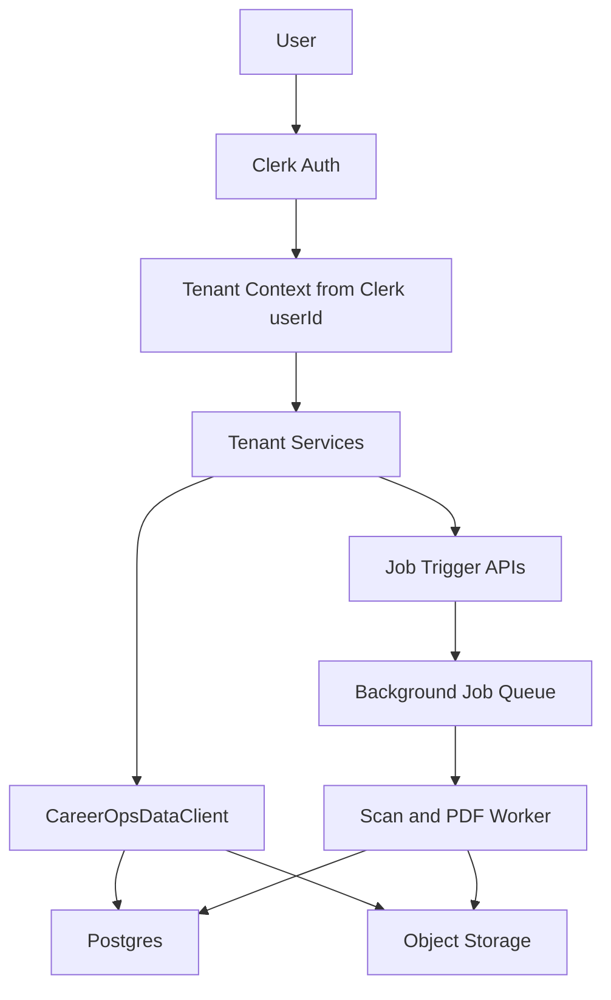
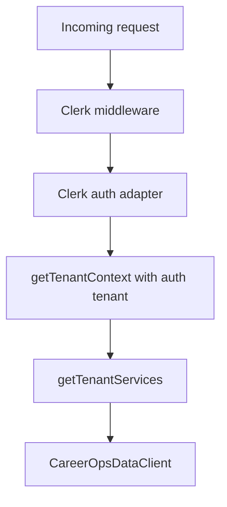
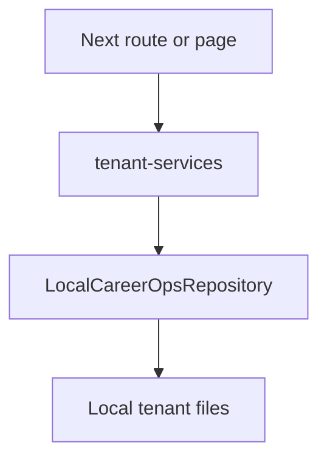
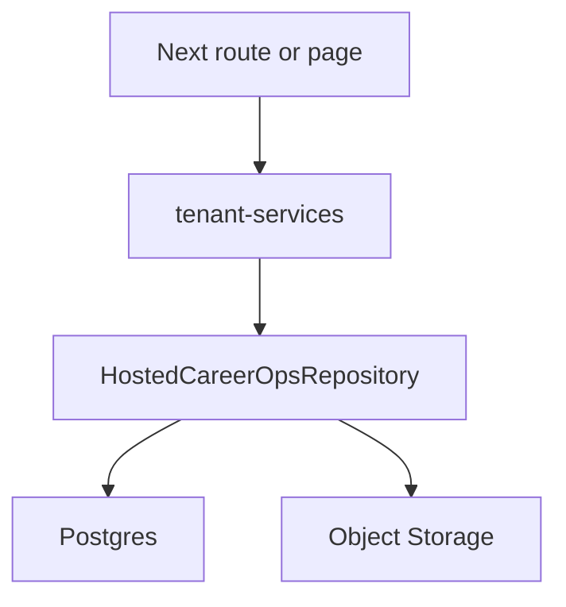
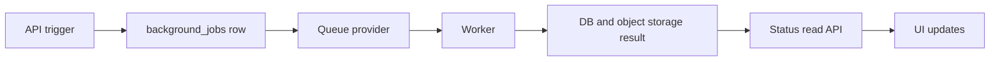

# Hosted Vercel Readiness

This document captures the target architecture for moving Career-Ops from a local filesystem and command-driven app to a hosted Vercel app. The hosted product model is single-user: each Clerk user owns one private job-search workspace with their own CV, profile, search criteria, queue, reports, and generated files.

## Architecture Decision

Use these defaults for the hosted app:

| Area | Decision | Rationale |
|------|----------|-----------|
| Auth | Clerk | Familiar provider, strong Next.js support, enough for single-user workspaces now |
| Tenant key | Clerk `userId` | One private workspace per user, no org model yet |
| App host | Vercel | Fits the interactive Next dashboard and API trigger layer |
| Structured data | Postgres | Durable, queryable source of truth for queue, applications, reports, profile, and scan state |
| File storage | Object storage | PDFs and larger user artifacts should not live in Vercel function storage |
| Background work | External job runner or worker | Scans, deep dives, liveness checks, and PDFs are too long or browser-heavy for normal request paths |
| Local development | Existing filesystem repository | Keeps the open-source/local workflow working while hosted storage is added |

Recommended provider pairings:

- Clerk + Neon + Vercel Blob + Inngest.
- Clerk + Supabase Postgres + Supabase Storage + Trigger.dev.
- Clerk + RDS/Neon + S3/R2 + a small container worker.

The first option is the most Vercel-native. The third option gives the most control if scan and browser workloads grow.

## Target Flow



## Route And Runtime Inventory

Active Next entrypoints should be treated as the hosted product surface. The Express server is legacy-only.

| Route | Type | Auth | Current runtime | Hosted target |
|-------|------|------|-----------------|---------------|
| `/` | Dashboard page | Required | Reads reports and pipeline through tenant services | Read Postgres-backed dashboard model |
| `/queue` | Queue page | Required | Reads queue stats, posts to `/api/queue` | Read DB queue state |
| `/scan` | Scan page | Required | Reads scan history and report stats | Read scan/job status from DB |
| `/job/[slug]` | Job detail page | Required | Reads report markdown and state | Read evaluation row plus markdown body |
| `/api/queue` | Mutation API | Required | Writes `data/pipeline.md` | Insert `pipeline_items` row |
| `/api/transition-state` | Mutation API | Required | Rewrites report frontmatter | Update evaluation workflow state and state history |
| `/api/scan` | Background trigger | Required | Runs `node scan.mjs` through `child_process` | Enqueue scan job and return job id |
| `/api/generate-resume` | Background trigger | Required | Runs Playwright in request | Enqueue PDF job |
| `/api/generate-cover-letter` | Background trigger | Required | Runs Playwright in request | Enqueue PDF job |
| `/api/generate-eval-report` | Background trigger | Required | Runs Playwright in request | Enqueue PDF job |
| `/api/generate-full-eval` | Background trigger | Required | Runs Playwright in request | Enqueue PDF job |
| `/download-pdf` | File access | Required | Reads tenant `output/*.pdf` | Authorize metadata row, stream/signed URL from object storage |
| `/api/health` | System route | Public | Stateless JSON | Keep public and stateless |

Hosted blockers found in the active path:

- `dashboard-web/app/api/scan/route.js` shells out through `dashboard-web/lib/services/tenant-cli-runner.js`.
- `dashboard-web/pdf-bundle-generator.js` launches Playwright directly.
- `dashboard-web/lib/repositories/local-career-ops-repository.js` persists user data with synchronous filesystem calls.
- `dashboard-web/lib/services/scan-service.js` reads scan history, pipeline, and reports from the current data client, which is still filesystem-backed.
- `dashboard-web/lib/tenant-context.js` has an auth placeholder but no Clerk integration.

## Data And Storage Map

The current user layer should move to Postgres and object storage while system files stay in the repo.

### Postgres Tables

| Table | Current source | Notes |
|-------|----------------|-------|
| `users` | Clerk user | Store `clerk_user_id`, email, timestamps |
| `user_profiles` | `config/profile.yml` | Store parsed YAML as JSON first; normalize later only if needed |
| `user_agent_profiles` | `modes/_profile.md` | Per-user narrative, archetypes, negotiation guidance |
| `search_configs` | `portals.yml` | Store parsed YAML as JSON; drives scan jobs |
| `documents` | `cv.md`, `article-digest.md`, interview docs | Store markdown text with `type` and optional slug |
| `pipeline_items` | `data/pipeline.md` | URL inbox and queue status |
| `applications` | `data/applications.md` | Tracker rows and canonical status |
| `evaluations` | `reports/*.md` | Parsed metadata plus markdown body |
| `evaluation_state_events` | report frontmatter history | Optional separate event table for workflow history |
| `job_descriptions` | `jds/*` | Raw or saved JDs tied to pipeline/evaluation records |
| `scan_events` | `data/scan-history.tsv` | Unique by `(user_id, url)` for scanner dedup |
| `scan_runs` | scanner execution output | Job/run status, counts, errors, started/finished timestamps |
| `follow_ups` | `data/follow-ups.md` | Follow-up dates, channel, notes |
| `generated_files` | `output/*.pdf` metadata | Storage key, filename, MIME, size, type, related entity |
| `background_jobs` | none today | Job type, status, payload, result, error |

### Object Storage

| Asset | Key pattern | Metadata table |
|-------|-------------|----------------|
| Generated PDFs | `users/{clerkUserId}/output/{fileId}.pdf` | `generated_files` |
| Uploaded/source CV files | `users/{clerkUserId}/documents/cv/{fileId}` | `documents` or `generated_files` |
| Optional generated HTML | `users/{clerkUserId}/tmp/{jobId}.html` | `background_jobs`, short TTL |

### Repo/System Files

These remain deploy-time system assets, not user records:

- `modes/*`, except per-user `modes/_profile.md`.
- `templates/*`.
- `fonts/*`.
- root scripts and reusable scanner/evaluation logic.
- `templates/states.yml`.
- docs and agent skills.

### Data Client Coverage Gaps

`CareerOpsDataClient` already covers most user-layer files. Before the hosted repository is complete, add coverage for:

- `modes/_profile.md`.
- `interview-prep/{company}-{role}.md`, not only `story-bank.md`.
- batch tracker additions, which should become DB inserts or job events instead of staged TSV files.

## Clerk Boundary Design

Clerk should become the only trusted production source of tenant identity.

Target behavior:

- Middleware protects all active product pages and APIs except `/api/health` and Clerk/public auth routes.
- Tenant identity is `auth().userId`.
- `x-tenant-id` remains available only for local development and tests.
- Production fails closed if Clerk does not provide a user id.
- The active app continues to call `getTenantServices` and `getTenantDashboardModel` so tenant resolution stays centralized.

Implementation shape:



Suggested adapter contract:

```js
function getClerkTenantContext() {
  const { userId } = auth();
  if (!userId) throw new Error('Authentication required');
  return { auth: { tenantId: userId } };
}
```

The exact API will depend on the installed Clerk Next.js version, but the important boundary is that route/page code passes a trusted auth tenant into the existing tenant context resolver.

## Repository Migration Design

Keep the app-facing API stable and swap storage behind it.

Current local flow:



Hosted target:



Migration steps:

1. Define a repository contract around the operations actually used by `CareerOpsDataClient`.
2. Keep `LocalCareerOpsRepository` as the development implementation.
3. Add `HostedCareerOpsRepository` for Postgres/object storage.
4. Select repository by environment mode:
   - `CAREER_OPS_TENANT_MODE=local-dev`: local filesystem.
   - `CAREER_OPS_TENANT_MODE=hosted`: Clerk user plus hosted persistence.
5. Add contract tests that run the same data-client behaviors against both implementations where possible.

Early hosted implementation should prioritize:

1. profile, CV, and search config.
2. queue and applications.
3. evaluations and workflow state.
4. generated files.
5. scan history and job status.
6. follow-ups, JDs, interview prep, and less-used documents.

## Background Job Strategy

Hosted request paths should trigger work, not run long local commands.

| Workload | Current behavior | Hosted behavior |
|----------|------------------|-----------------|
| Standard scan | `/api/scan` runs `scan.mjs` with `execFile` | enqueue `scan` job, persist status in `background_jobs` and `scan_runs` |
| Deep-dive scan | scanner can load Playwright scrapers | run only in browser-capable worker |
| PDF generation | API route launches Playwright and writes output | enqueue `pdf` job, worker writes object storage, API returns job id |
| Liveness checks | root CLI uses Playwright | worker job, usually scheduled or attached to evaluation flow |
| Tracker merge/dedup/normalize | file mutation scripts | replace with DB writes and maintenance jobs |
| Pipeline verification | reads local files | DB integrity checks or admin diagnostics |

Job lifecycle:



The root scripts can remain useful for local and agent workflows, but hosted routes should not depend on a writable repo checkout or `child_process`.

## Vercel Hardening

Before production deploy:

- Add Clerk middleware and fail-closed auth behavior.
- Add hosted environment documentation:
  - `CLERK_SECRET_KEY`.
  - `NEXT_PUBLIC_CLERK_PUBLISHABLE_KEY`.
  - database connection string.
  - object storage credentials.
  - job provider signing keys or API keys.
  - `CAREER_OPS_TENANT_MODE=hosted`.
- Add Vercel configuration only after scan/PDF work is moved out of request paths.
- Keep `/api/health` public and stateless.
- Do not bundle Playwright into normal interactive API functions if PDF generation is handled by a worker.
- Do not rely on `CAREER_OPS_PATH` for user data in hosted mode.
- Do not allow production fallback to `local-dev`.
- Keep `dashboard-web/LEGACY.md` as the boundary for Express-only code.

## Verification Plan

Each hosted migration slice should keep the existing quality gate and add focused hosted tests.

Baseline:

- `npm test` in `dashboard-web`.
- `npm run build` in `dashboard-web`.
- lint diagnostics for changed files.

Hosted-specific tests:

- Clerk auth adapter resolves tenant from user id.
- Production rejects unauthenticated tenant resolution.
- Dev-only `x-tenant-id` still works outside production.
- Repository contract tests cover local and hosted-style adapters.
- `/api/scan` and PDF APIs enqueue jobs instead of running local commands in hosted mode.
- Download authorization checks `generated_files.user_id` before returning object storage content or signed URLs.

## Implementation Order

1. Add Clerk dependency, middleware, auth adapter, and tenant tests.
2. Add database schema and migration tooling.
3. Add object storage client and `generated_files` metadata flow.
4. Add hosted repository implementation behind `CareerOpsDataClient`.
5. Move profile, CV, search config, queue, applications, and evaluations to hosted storage.
6. Convert scan and PDF routes into job triggers.
7. Add worker implementation for scan, liveness, and PDF jobs.
8. Remove or guard hosted use of local filesystem, `child_process`, and direct Playwright.

## Known Follow-Up Bug

`dashboard-web/lib/services/scan-service.js` references `path.basename` without importing `path`. This is separate from the hosted architecture work, but it should be fixed before relying on the scan page with existing report data.
